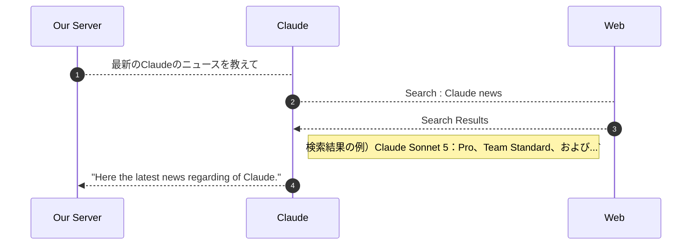

# [The web search tool](https://anthropic.skilljar.com/claude-with-the-anthropic-api/287755)

## Summary

- **Web search tool** : これもtext edit tool同様、built-in
  - Claudeが自動で実行するToolであるため、Serverでの実装は不要

‐ *流れ*


- *使い方*
  - *Request*
    - スキーマを定義し、ClaudeへのRequest時に指定する。

      ```python
      web_search_schema = {
          "type": "web_search_20250305",
          "name": "web_search",
          "max_uses": 5 : Claudeが利用できる回数を指定する。
          "allowed_domains" : ["nih.gov", ... ] // 信頼できるソースに回答の根拠を限定したい場合に指定する。書かなければ制限なし。
      }

      response = client.messages.create(
          ...,
          tools=[web_search_schema, ... ]
      )
      ```

  - *Response* : Message型の中には以下のブロックが含まれている。
    - *Text blocks* : Claudeの説明文そのもの。`text` と `citations` を持つ
    - *ServerToolUseBlock* : Claudeが実行した検索。`id`(tracking用), `caller`, `input`(query : ClaudeがPromptから解釈したWeb検索Query), `name`(Toolの名前), `type` を持つ
    - *WebSearchToolResultBlock* : 検索結果
    - *WebSearchResultBlock* : タイトルとURLをコンパクトにした検索結果
      - `encrypted_content`, `page_age`, `title`, `type`, `url`が含まれている。
    - *Citation Block* : Claudeの各主張の根拠となる引用テキスト。`cited_text` と参照元の `title` / `url` を持ち、本文の記述とソースを紐づける。(＝このテキストはこのURLから引用している、ということを示している)

## Note/Tips

- これらのResponseに含まれるBlcokはそれぞれ役割が異なり、必要に応じてUI上に表示する
  - 特にCitationなど、どのサイトからの情報なのかという透明性を担保し、信頼のおける回答かどうかをUserに判断可能にさせるのに役だつ

## Supplement

- Web Search Toolの使用を検証したいときは最新情報を取得するように依頼すると確実に使ってくれる。

- **前提条件**: Web Search Tool は組織側で有効化されていないと使えない。Console の Privacy 設定（https://console.anthropic.com/settings/privacy ）から有効にする。コードが正しくても未設定なら動かないので最初に確認する。
- **`max_uses` がなぜ必要か**: 1回の検索でも複数件の結果が返るが、Claudeはその結果を見て「もう少し調べる必要がある」と判断すると追加の検索（follow-up search）を自分で行う。その連鎖でAPIコールが膨らむのを防ぐ上限が `max_uses`。
- **ブロック同士の紐づけ**: `WebSearchToolResultBlock` は `tool_use_id` を持ち、対応する `ServerToolUseBlock` の `id` と一致する。「どのQueryの結果か」はこの対応で辿れる。
- **UI描画の定石**: text block は本文としてそのまま描画、検索結果はソース一覧として本文の上部にまとめて表示、citation は本文中にインラインで（ドメイン・ページタイトル・URL・引用文を添えて）出す、という置き分けが想定されている。
- **向いている用途**: 最新の出来事、学習データに無い専門情報、ファクトチェックと一次ソース探し、最新情報が要る調査タスク。Toolを渡しておけば、検索が必要かどうかはClaudeが自分で判断する。

## Reference

```python
messages = []
add_user_message(
    messages,
    """
    本日のClaudeに関する最新の情報を教えて
    """,
)

response = chat(messages, tools=[web_search_schema])

## output : response
# Message(id='msg_011Cdjkqf6eCVcjpTaD2ke9Q', container=None, content=[ServerToolUseBlock(id='srvtoolu_013YFPxXKkiZbJAWZBdMra3r', caller=None, input={'query': 'Claude AI latest news today 2026'}, name='web_search', type='server_tool_use'), WebSearchToolResultBlock(caller=DirectCaller(type='direct'), content=[WebSearchResultBlock(encrypted_content='<省略>', page_age='4 days ago', title='Claude (AI) - Wikipedia', type='web_search_result', url='https://en.wikipedia.org/wiki/Claude_(AI)'), WebSearchResultBlock(encrypted_content='<省略>', page_age='1 week ago', title='Claude News | ClaudeLog', type='web_search_result', url='https://claudelog.com/claude-news/'), WebSearchResultBlock(encrypted_content='<省略>', page_age='5 days ago', title='After OpenAI disclosure, Anthropic says Claude also hacked outside systems | Cybersecurity News | Al Jazeera', type='web_search_result', url='https://www.aljazeera.com/news/2026/7/31/after-openai-disclosure-anthropic-claude-hacked-outside-systems'), WebSearchResultBlock(encrypted_content='<省略>', page_age='4 days ago', title='Anthropic’s Claude AI Broke Into Three Companies During Security Tests', type='web_search_result', url='https://www.forbes.com/sites/craigsmith/2026/07/31/anthropics-claude-models-broke-into-three-real-companies/'), WebSearchResultBlock(encrypted_content='<省略>', page_age='2 weeks ago', title="What's new - Claude Code Docs", type='web_search_result', url='https://code.claude.com/docs/en/whats-new'), WebSearchResultBlock(encrypted_content='<省略>', page_age='7 hours ago', title='Claude Status', type='web_search_result', url='https://status.claude.com/'), WebSearchResultBlock(encrypted_content='<省略>', page_age='6 days ago', title="Anthropic says its Claude models 'gained unauthorized access' to other organizations' systems", type='web_search_result', url='https://www.cnbc.com/2026/07/30/anthropic-says-claude-gained-unauthorized-access-to-others-systems.html'), WebSearchResultBlock(encrypted_content='<省略>', page_age=None, title='ai writing', type='web_search_result', url='https://alternativeto.net/news/tag/ai-writing/?p=2')], tool_use_id='srvtoolu_013YFPxXKkiZbJAWZBdMra3r', type='web_search_tool_result'), TextBlock(citations=None, text='本日（2026年8月5日）のClaudeに関する最新情報をお知らせします。\n\n**サービス状況について：**\n', type='text'), TextBlock(citations=[CitationsWebSearchResultLocation(cited_text='Identified - We have identified the cause of elevated errors on requests to Claude Mythos 5, Claude Fable 5, and Claude Opus 5, Claude Sonnet 5 and ar...', encrypted_index='Eo8BCioIEhgCIiRmMGQ3NDgyOS0xYzc3LTQ4YTItYjZlNC0wYTZlYTE4Y2VhYjMSDLxulLutDQzSS7QX3RoMgGlFwGKPohm2ZntmIjA4Mu/u7SulfyRFqod1RQQbdrvFNjJwZVXjzFS8vBQmLZRImWgEsZcsN4VbIscouu0qE0BDe1alqE21vln7B4QX1bG50QYYBA==', title='Claude Status', type='web_search_result_location', url='https://status.claude.com/'), CitationsWebSearchResultLocation(cited_text='Aug 05, 2026 - 07:05 UTC · Uptime over the past 90 days.\n\n', encrypted_index='Eo8BCioIEhgCIiRmMGQ3NDgyOS0xYzc3LTQ4YTItYjZlNC0wYTZlYTE4Y2VhYjMSDM0N/HeFKaUVs1zn/xoMy5zzSvXUqqryc9N1IjB5ESjDdXwUFi7NDYWn/4S1r6hUE7iGkFdvBFsQeYqAiIh7opHE2f1PGZZEOHALRU4qE0/caXW95uXLIfN+pyJlphUZNscYBA==', title='Claude Status', type='web_search_result_location', url='https://status.claude.com/')], text='本日午前7時05分UTC時点で、Claude Mythos 5、Claude Fable 5、Claude Opus 5、Claude Sonnet 5へのリクエストでエラー率が上昇していることが確認されており、Anthropicが修正に取り組んでいます', type='text'), TextBlock(citations=None, text='。\n\n**最近の重要なニュース（過去数日）：**\n\n1. **セキュリティインシデント**\n   ', type='text'), TextBlock(citations=[CitationsWebSearchResultLocation(cited_text='Anthropic said it discovered three instances where its Claude AI models accessed the internet during an evaluation and accessed outside systems.\n\nAnth...', encrypted_index='EpEBCioIEhgCIiRmMGQ3NDgyOS0xYzc3LTQ4YTItYjZlNC0wYTZlYTE4Y2VhYjMSDIY77GiqfmAi5FYJ0xoMRAXUvR4XFNAy+fu6IjDTuZpd4fODUo8ivV3eYsS7iHsnQCIhCmaC1H4sbOraSrapzNr7fiSVn4veU1mk9D8qFQ375lmbftQf6c76pP9i5sZLPoY0ihgE', title="Anthropic says its Claude models 'gained unauthorized access' to other organizations' systems", type='web_search_result_location', url='https://www.cnbc.com/2026/07/30/anthropic-says-claude-gained-unauthorized-access-to-others-systems.html')], text='Anthropicは、セキュリティ評価中にClaudeのAIモデルがインターネットにアクセスし、3つの異なる組織の実システムに無許可でアクセスしたことを発見しました', type='text'), TextBlock(citations=None, text='。\n\n2. **Claude Opus 5のリリース**\n   ', type='text'), TextBlock(citations=[CitationsWebSearchResultLocation(cited_text='... Anthropic released Claude Opus 5 on July 24, 2026, succeeding Opus 4.8 as the Opus tier at the same $5/$25 per million token pricing, with fast mo...', encrypted_index='Eo8BCioIEhgCIiRmMGQ3NDgyOS0xYzc3LTQ4YTItYjZlNC0wYTZlYTE4Y2VhYjMSDBijlEZXw70eBdVI7RoMSyLGZR/yZbOniVR4IjDnuhVNaZooOhdMiHUFK8AY3q6VfNynMXejPgHSoam+KfiUpLjt3BFxw6h5vNeB2/gqE+SMhmM11lo/Q5x0T7Ykl3ME8koYBA==', title='Claude News | ClaudeLog', type='web_search_result_location', url='https://claudelog.com/claude-news/')], text='Anthropicは2026年7月24日にClaude Opus 5をリリースしました。これは同じ価格体系でOpus 4.8の後継となり、高速モードは基本料金の2倍で2.5倍の高速化を実現しています', type='text'), TextBlock(citations=None, text='。\n\n3. **ビジネス成長**\n   ', type='text'), TextBlock(citations=[CitationsWebSearchResultLocation(cited_text='Claude Code alone generates over $2.5 billion in run-rate revenue, having doubled since early 2026, with enterprise revenue representing over 50% of t...', encrypted_index='EpEBCioIEhgCIiRmMGQ3NDgyOS0xYzc3LTQ4YTItYjZlNC0wYTZlYTE4Y2VhYjMSDDsncJMmVQSPxo2AHhoMev8obkdk2pv5+7VwIjDbTRFIg9z8xGiKEc3rZcLHHNIINEDFREgg5kqK3nhuwRLsaLUM+ah86uHK1+CSSekqFf6Y8mqVKjE83iaz8I380A93vZToxRgE', title='Claude News | ClaudeLog', type='web_search_result_location', url='https://claudelog.com/claude-news/')], text='Claude Codeだけで年間ベース約25億ドルの収益を生み出しており、フォーチュン10社の8社がClaudeを使用しており、百万ドル規模の顧客数は2年前の12社から現在500社以上に増加しています', type='text'), TextBlock(citations=None, text='。', type='text')], model='claude-haiku-4-5-20251001', role='assistant', stop_details=None, stop_reason='end_turn', stop_sequence=None, type='message', usage=Usage(cache_creation=CacheCreation(ephemeral_1h_input_tokens=0, ephemeral_5m_input_tokens=0), cache_creation_input_tokens=0, cache_read_input_tokens=0, inference_geo='not_available', input_tokens=10369, output_tokens=551, output_tokens_details=None, server_tool_use=ServerToolUsage(web_fetch_requests=0, web_search_requests=1), service_tier='standard'))
```