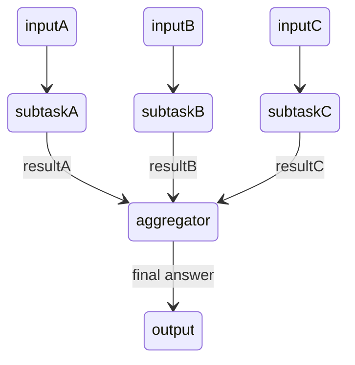

# [Parallelization workflows](https://anthropic.skilljar.com/claude-with-the-anthropic-api/287804)

## Summary

- **Parallelization workflow** : 一つの巨大な、複数要件がまとまったリクエストを、**互いに独立して評価できる**単位に分割して*sub-tasks*としてClaudeに送信し、その複数の結果をClaudeに取りまとめる(*aggregator*)ようにリクエストする方法
  - *メリット*
    - *正確性*: それぞれの要件に応じて結果を得るため、Claudeの認知負荷が下がり、正確な、信頼性のある推論ができる。
    - *保守性*: 一つの結果が悪い時にも、その一つについてのpromptを修正するだけでいいのでほかに悪影響を及ぼさずに最適化可能
    - *拡張性*: 他の並列的な要素についても同様に増やし、aggregateすればいいだけなので、再度全体を再推論する必要がない。
    - *時間効率* : それぞれが並列して処理するため、全体の処理時間の削減になる。

## Note/Tips

## Supplement

- 一つのリクエストにいろんなことを書き過ぎると、それぞれの要件を同時に満足させようとするが、Claudeが混乱したり最適ではない結果を返却してしまう。
- sub-taskは同一である必要はなく、それぞれの要件、プロンプト、Toolsを定義・送付可能。
- 分割されるのは入力ではなく「観点」であることが多い。典型的には**同じ入力**を全sub-taskに送り、sub-taskごとに異なる評価基準（材料候補ごとの判定基準など）を持たせて、それぞれ独立に判定させる。

## Reference

