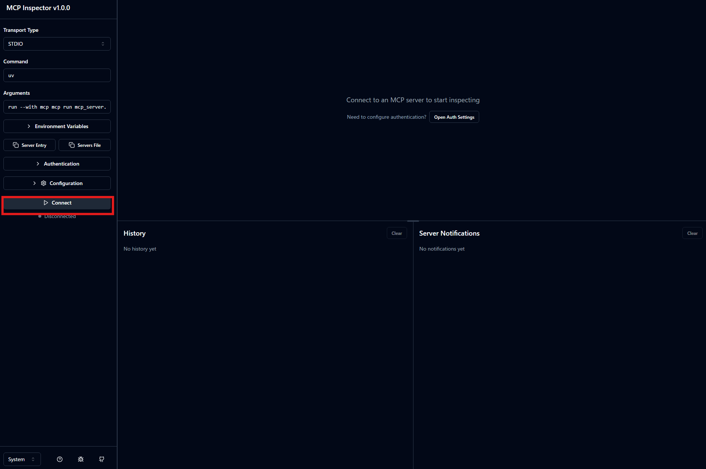
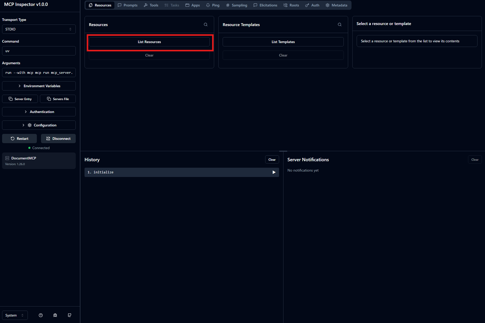
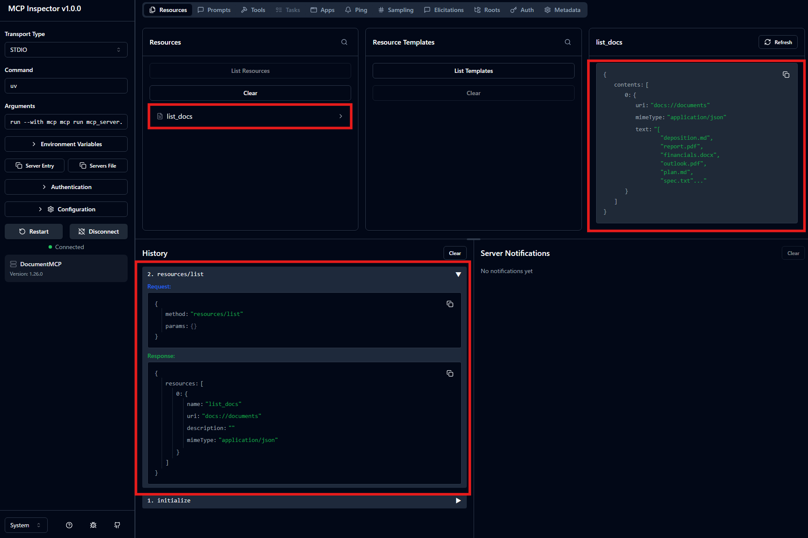
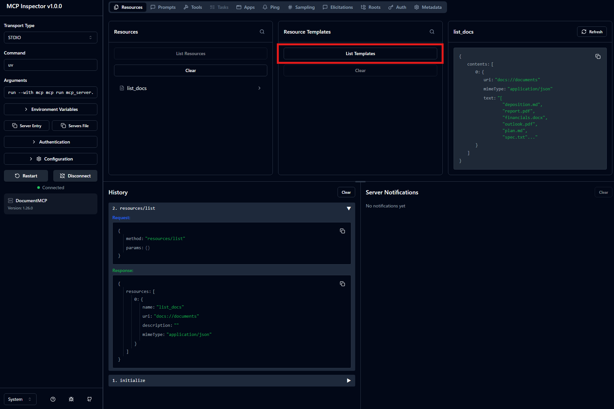
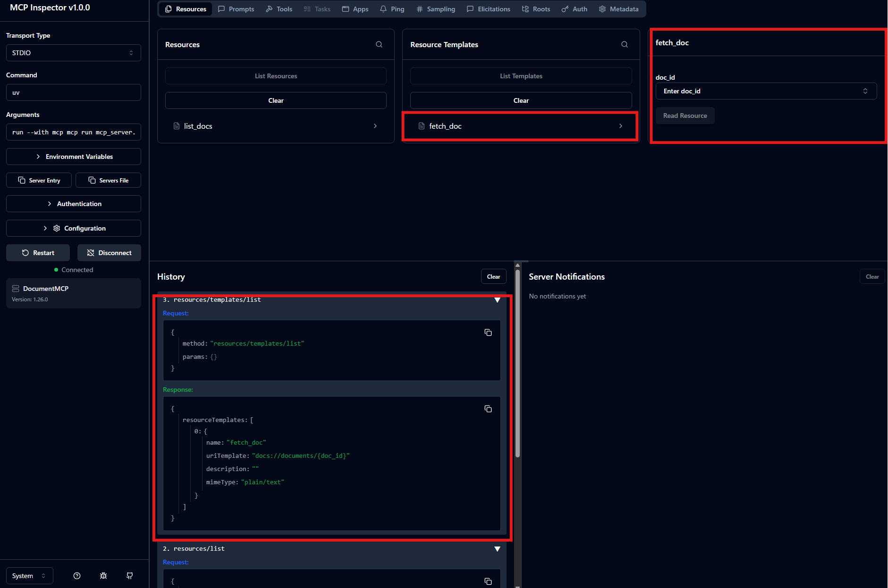
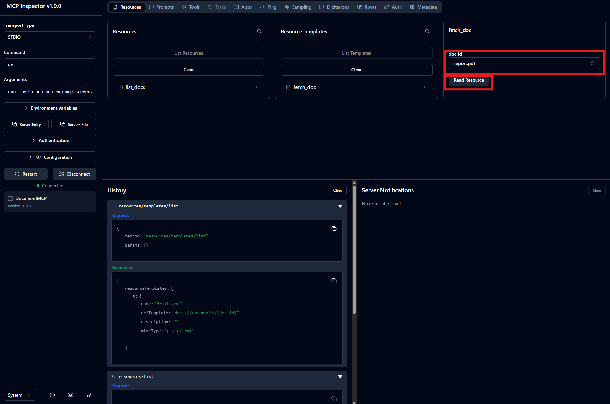
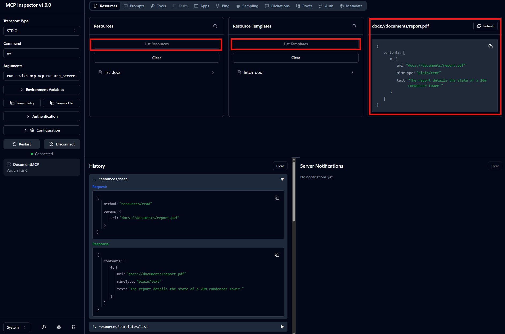

# [Defining resources](https://anthropic.skilljar.com/introduction-to-model-context-protocol/296699)

## Summary

- MCP の Resource はクライアントに read-only データを公開する仕組み（HTTP の GET ハンドラ相当。アクション用の Tool に対し、fetch 用途）。その応用例として`@document_name`のようにメンション機能を実装する場合、2つ必要な機能がある。
  1. autocomplete機能のために、例えば、Prompt作成時に、Prefixが同じファイル名の一覧を取得する機能
     - これは以下のように記述するだけで十分
       - リストが欲しい場合
        ```python
        @mcp.resource(
            "docs://documents",
            mime_type="application/json"
        )
        def list_docs() -> list[str]:
            return list(docs.keys())
        ```
  2. Prompt送信時、該当するdocument_nameを持つファイルの中身を自動で取得し、Claudeに渡す機能
     - これは以下のように記述するだけで十分
       - 特定のDocumentを取得する場合
        ```python
        @mcp.resource(
            "docs://documents/{doc_id}",
            mime_type="text/plain"
        )
        def fetch_doc(doc_id: str) -> str:
            if doc_id not in docs:
                raise ValueError(f"Doc with id {doc_id} not found")
            return docs[doc_id]
        ```

- `mime_type`には関数の返却値に合わせて以下のように指定する
  - `"application/json"` -> structured data
  - `"text/plain"` -> plain tex
  - `"application/pdf"` -> binary files

- これらのプロセスをInspector Toolを使って検証可能。詳細はSupplementに。

### Note/Tips

- Promptに含まれるメンション`@`を解決するフロー
    - 各リソース間では以下のような処理になる。
    ```mermaid
    sequenceDiagram
        User ->> Our Code : What's in the @.*
        Our Code ->> MCP Client : I need a list of document names to put in the autocomplete
        MCP Client ->> MCP Server : ReqdResourceRequest(docs://documents)
        MCP Server -->> MCP Client : ReadResourceResult(List of doc names)
        MCP Client -->> Our Code: Great! I'll put these doc names into the autocomplete
    ```


## Supplement

- Resource には2種類ある。
  - **Direct Resource**: 静的URI
    - （`docs://documents` のように静的URIで引数を取らない。summary の `list_docs` が該当）
  - **Templated Resource**: 動的URI
    - （`docs://documents/{doc_id}` のようにURIに引数を含む。summary の `fetch_doc` が該当）
    - Python SDK がURI中の `{doc_id}` を自動でパースし、キーワード引数として関数に渡してくれる。

- `mime_type` はあくまでクライアントへの「ヒント」に過ぎない。SDK が返却値を自動シリアライズするため、手動で JSON 文字列へ変換する必要はなく、データ構造をそのまま return すればよい。

- 本講座のテストは以下。
  - ※ `mcp_server.py`に`list_docs()`, `fetch_doc()`を記載し以下を実行する。
  - testコマンドを実行する
    ```sh
    uv run mcp dev mcp_server.py
    ```
  - ブラウザでInspectorを以下の通り操作する
    1. CONNECT
    
    2. List Resources > list_docs とクリックし、右にdocument_id一覧が表示される
    
    
    3. List Templates > fetch docとクリックすると、右でdoc_idを指定する画面になる。
    
    
    4. doc_id(report.pdfなど)を指定し、Read Resourcesをクリックすることで、documentの中身をえられていることを確認できる
    
    

## Reference

