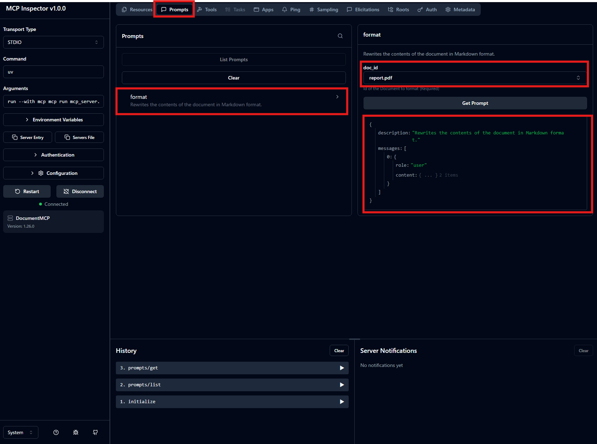
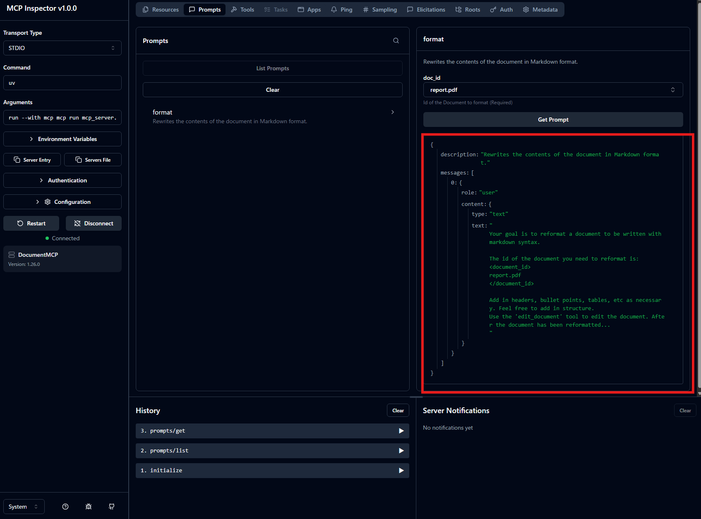

# [Defining prompts](https://anthropic.skilljar.com/introduction-to-model-context-protocol/296698)

## Summary

- MCPサーバーのprompt機能
  - MCPサーバーの機能に特化したPromptを開発者側で事前に用意できる機能
  - 利点
    - *簡便性*：Userは自身でPromptを考える必要がなくなる
    - *専門性*：MCPのDomainに特化したPromptが使える
    - *再利用性*：接続するどのApplicationも同じ`@mcp.prompt`の関数を使える
    - *保守性*：更新時は特定の関数のみ修正すればいい。

- prompt機能実装には`@mcp.prompt(name="", descriptyion="")`を使う。`/format`のようにカスタムコマンドを解釈させる場合はformatをnameに記載する。descriptionは特定できるように書く。引数はデコレータを紐づけた関数の引数として書く。

### Note/Tips

- `@mcp.prompt`の例
    ```python
    from mcp.server.fastmcp.prompts import base

    @mcp.prompt(
        name="format",
        description="Rewrites the contents of the document in Markdown format."
    )
    def format_document(
        doc_id: str = Field(description="Id of the document to format")
    ) -> list[base.Message]:
        prompt = f"""
    Your goal is to reformat a document to be written with markdown syntax.

    The id of the document you need to reformat is:
    <document_id>
    {doc_id}
    </document_id>

    Add in headers, bullet points, tables, etc as necessary. Feel free to add in structure.
    Use the 'edit_document' tool to edit the document. After the document has been reformatted...
    """

        return [
            base.UserMessage(prompt)
        ]
    ```

## Supplement

- promptの関数は文字列ではなく「メッセージのリスト」（`list[base.Message]`）を返し、それがそのままClaudeに送られる。`base.UserMessage`だけでなく`base.AssistantMessage`も混ぜられるので、複数ターンの会話（User/Assistantの往復）をあらかじめ組み込んだ複雑なプロンプトも定義できる。

- Inspectorでのテスト
1. connectで接続し上部タブでpromptを選択する。formatを選択し、doc_idを指定(report.pdfなど)出力を確認する。

1. 出力にはdescirptionとmessageのリストが定義通り返っており、どんなPromptがClaudeに送信されるかがわかる。


## Reference

