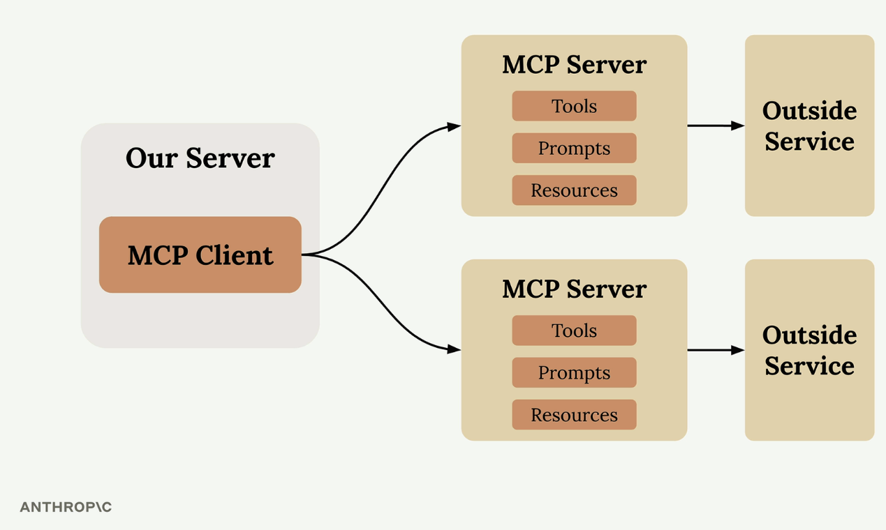
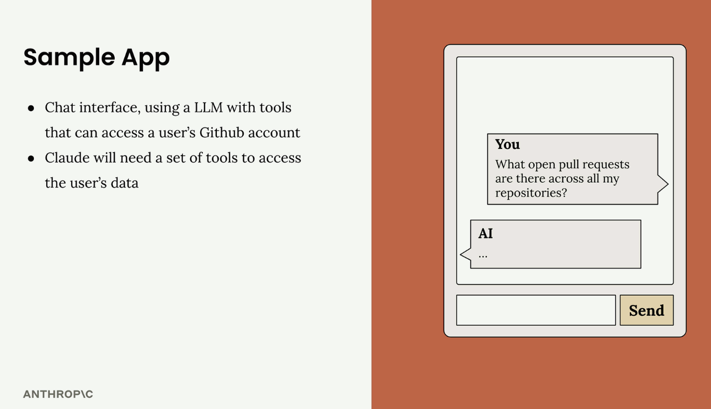
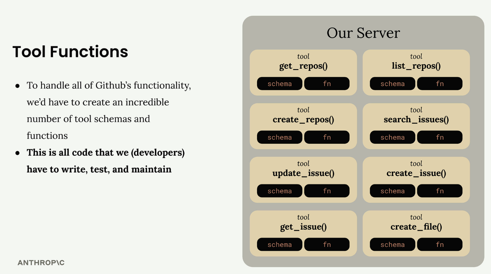
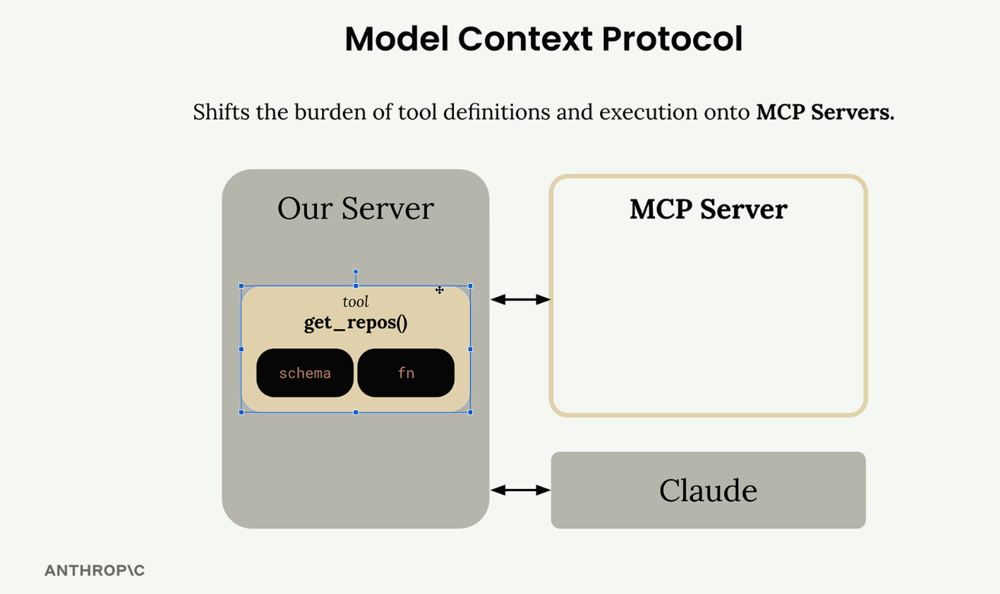
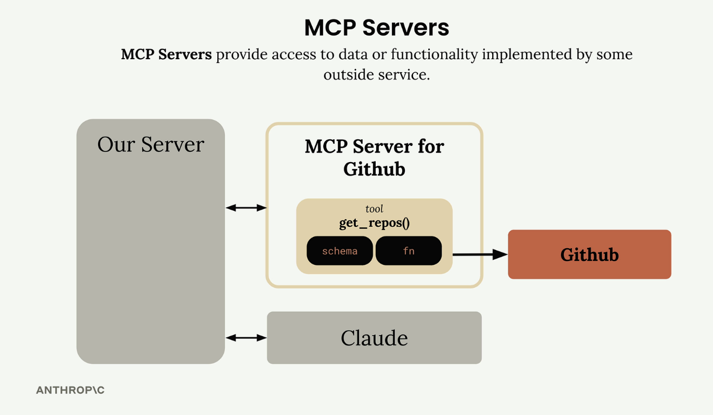

# Introducing MCP

Video

Model Context Protocol (MCP) is a communication layer that provides Claude with context and tools without requiring you to write a bunch of tedious integration code. Think of it as a way to shift the burden of tool definitions and execution away from your server to specialized MCP servers.

When you first encounter MCP, you'll see diagrams showing the basic architecture: an MCP Client (your server) connecting to MCP Servers that contain tools, prompts, and resources. Each MCP Server acts as an interface to some outside service.

## The Problem MCP Solves

Let's say you're building a chat interface where users can ask Claude about their GitHub data. A user might ask "What open pull requests are there across all my repositories?" To handle this, Claude needs tools to access GitHub's API.

GitHub has massive functionality - repositories, pull requests, issues, projects, and tons more. Without MCP, you'd need to create an incredible number of tool schemas and functions to handle all of GitHub's features.

This means writing, testing, and maintaining all that integration code yourself. That's a lot of effort and ongoing maintenance burden.

## How MCP Works

MCP shifts this burden by moving tool definitions and execution from your server to dedicated MCP servers. Instead of you authoring all those GitHub tools, an MCP Server for GitHub handles it.

The MCP Server wraps up tons of functionality around GitHub and exposes it as a standardized set of tools. Your application connects to this MCP server instead of implementing everything from scratch.

## MCP Servers Explained

MCP Servers provide access to data or functionality implemented by outside services. They act as specialized interfaces that expose tools, prompts, and resources in a standardized way.

In our GitHub example, the MCP Server for GitHub contains tools like get_repos() and connects directly to GitHub's API. Your server communicates with the MCP server, which handles all the GitHub-specific implementation details.

## Common Questions

### Who authors MCP Servers?

Anyone can create an MCP server implementation. Often, service providers themselves will make their own official MCP implementations. For example, AWS might release an official MCP server with tools for their various services.

### How is this different from calling APIs directly?

MCP servers provide tool schemas and functions already defined for you. If you want to call an API directly, you'll be authoring those tool definitions on your own. MCP saves you that implementation work.

### Isn't MCP just the same as tool use?

This is a common misconception. MCP servers and tool use are complementary but different concepts. MCP servers provide tool schemas and functions already defined for you, while tool use is about how Claude actually calls those tools. The key difference is who does the work - with MCP, someone else has already implemented the tools for you.

The benefit is clear: instead of maintaining a complex set of integrations yourself, you can leverage MCP servers that handle the heavy lifting of connecting to external services.