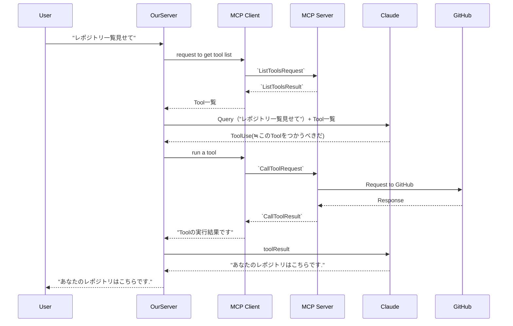

# [MCP clients](https://anthropic.skilljar.com/introduction-to-model-context-protocol/296690)

## Summary

- MCP serverとMCP client間では様々なProtocolを用いて通信される。
- MCP client と server が同一マシン上で動く構成が最も一般的で、その場合は標準入出力（stdio）で通信する。ネットワーク越しに接続する場合は HTTP や WebSocket などのプロトコルを使う。どちらでも動くこと（transport agnostic）が MCP の強み。

- MCPではどういったメッセージの形でclient-server間での通信がなされるのかを規定している

- 通信の概要（MCP Client がこの複雑なフローを抽象化し、こちらのサーバーはアプリケーションロジックに集中できる）:

### Note/Tips

- **ListToolsRequest/ListToolsResult** : どんなツールを呼び出せる？/ツールの一覧を返却
- **CallToolRequest/CallToolResult** : このツールを実行して/実行結果を返却

## Supplement

- 大まかな流れ
1. MCP ClientはまずMCP ServerにTool一覧を取得する。
1. 自身のServerからClaudeに対しTool一覧とQueryを渡し、Queryに応じてどのToolを使うべきかはClaudeが判断し、回答する
1. そのToolをつかうように自身のServerが、MCP Clientに指示を出し、MCP Serverを経由して外部ツールなどにアクセスし、結果を得て、MCP Clientがサーバーにテキストとして返却する

- MCP client の定義（原文冒頭）: 自身のサーバーと MCP server をつなぐ **通信ブリッジ**であり、MCP server が提供する全ツールへの**アクセスポイント**。メッセージ交換とプロトコルの詳細を肩代わりするので、アプリケーション側はそれらを実装しなくてよい。
- 「Toolを使うべきだ」という判断（ToolUse）を返すのは常に Claude であり、MCP Client でも MCP Server でもない。MCP Client は「呼べ」と言われたものを CallToolRequest に変換して投げるだけの層である、という責務の分離がこのフローの要点。

## Reference

