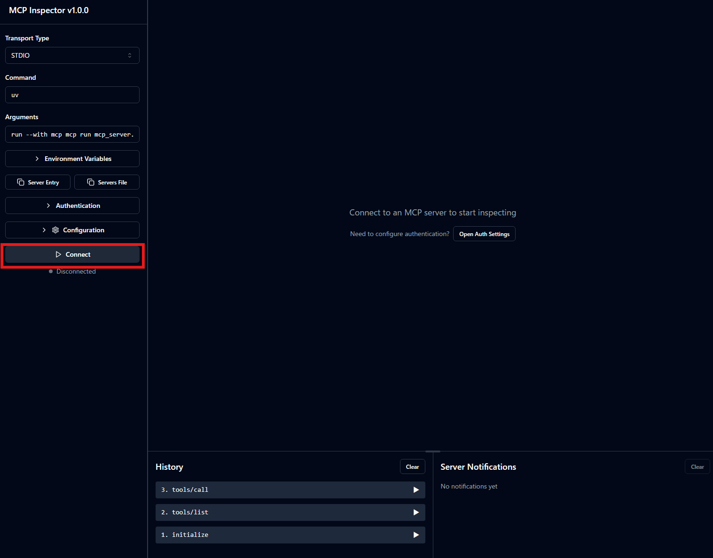
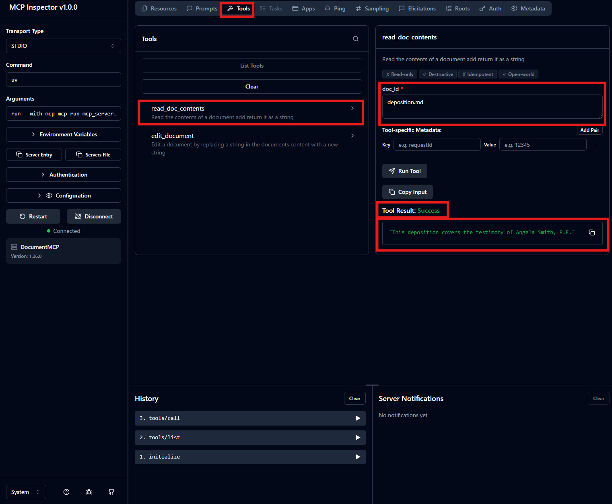

# [The server inspector](https://anthropic.skilljar.com/introduction-to-model-context-protocol/296693)

## Summary

- MCP Inspector: PythonのMCP SDKを利用することで、inspectorを起動しデバッグできるツール
- 利点：
  - Inspectorを使ことでMCPServerの振る舞いが想定通りかを確認できる。LLMのAPIを実際に叩く前の部分、たたいた後の部分を確認できるので、モデルの使用コストを払わずに確認できる
  - Full Applicationとして接続せず MCP サーバー単体を、ブラウザから即座にテスト・デバッグできる
  - edit→read のように、ツール呼び出し間でサーバーの状態が保持される（編集が persist する）ことも確認できる
- EditのToolを使って編集し、Readでそれを読み取るといった複数の操作も確認可能

- PythonのScriptにて`try ~ except ...`と記載したエラー処理を、極端なケース(Edge case)であっても、模擬的に実験しMCPとしてエラー処理することを確認可能
- 素早く修正し、効率的に実装できる

### Note/Tips


## Supplement

- `cli_project/`下で`uv add "mcp[cli]"`によりmcpパッケージをインストールする
- `uv add`ではPATHにmcpが載らないので以下のコマンドで起動すると起動できる。
    ```sh
    uv run mcp dev mcp_server.py
    ```

- Inspector起動方法
  - コマンド
      ```sh
      mcp dev mcp_server.py
      ```
  - ※ 私の環境(PowerShell)では以下が有効だった。
      ```sh
      uv run mcp dev mcp_server.py
      ```

- Tool: `read_docs_contents`の確認手順
  1. 左ペイン下部の`Connect`を押下し接続。
    - 
  2. 上部タブで`Tools`を選択
  3. `read_docs_contents`を選択
  4. `doc_id`にIDを指定(deposition.md)し、 `Run Tool`をクリック
  5. Tool Resultに結果(`Success`)が出て、その下に返却された値(`This deposition covers the testimony of Angela Smith, P.E.`)が出る。
    

## Reference

- [【Python】最低限の手順でMCPサーバーを構築するメモ](https://qiita.com/yonaka15/items/845ecab89c3c245fbb95)