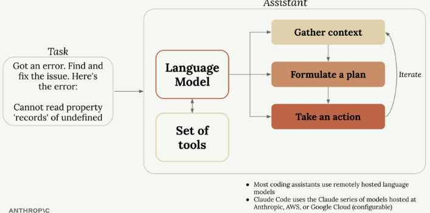

# What is a coding assistant?

Video
- Transcription
> In this video, we're going to get a better understanding of what acoding assistant is.
> Yes, a coding assistant is  atool that writes code, but I want to give you a deeper understanding of what's going on behind the scenes.
> You see, by understanding what a coding assistant really *does* and how it works, you'll have a greater appreciation of what makes a truly amazing assistant to comprement your team.
> Here's one way that you can picture what a coding assistant is doing.
> An assistant is first given a task .
> In this case, maybe the assistant needs to fix a bug based upon some kinds of error message.
> This taks is passed off internally to a language model, which needs to figure out how to solve the issue.
> Now, different language models solve problems in very different styles depending upon the complexity of the task.
> But in many cases, they work very much like how a human would work.
> It first might need to gather context by understanding what the error is referring to, what area in the code base is throwing the error, and what files seem to be relecant.
> Once it has gathered that information, it then needs to fomulate a plan on how it will actually accomplish the task.
> In this case, it might decide to change some code and then run or write a test to verify that the issue is actually fixed.
> Finally, it will take an action.
> In this case, that might be updating a file and running the test.
> Now, I want to give you some more information on this entire process.
> In particular, I'd like you to notice that the first and last steps here require the coding assistant to actually do something.
> In other words, to actually gather information from the outside world or affect the outside world in some way.
> For example, to gather context, the assistant needs to maybe read a file or fetch some documentation online.
>
> And for taking an action, the assistant might need to acutally run a command or edit a file.
>
> Now, having a language model actually do these things is a little bit trickier thant it actually sounds.
> Let me help you understand why that is.
> Let's imagine that we are interacting with a language model directly, so it's not runnign inside of any coding assistant or anything like that.
> Let's then imagine that we asked this language model directly what code is written inside the main.go file.
> Language model is running outside the context of any coding assistant or similar tool do not inherently have the ability to say read a file or write a command or anything like that.
> Language models take in content like text and they return text.
> That's the entire extent of their capabilities.
> And this is true of all language models.
> So if you were to send some text into a plain language model asking to read a file, it would most likely respond by saying that it doesn't have the ability to read any files.
> So let me show you what coding assistance and many, many other tools out there do to actually allow a language model to, quote unquote, read a file.
> So here's what happens.
> Whenever you send a request off to your coding assistant, the coding assistant behind the scenes is going to automatically append a lot of text into you request.
> In this particular case, we can imagine that the coding assistant is goint to add on some text that sayssomething like, if you, language model, want to read a file, respond with wthis very carefully formatted message.
> For example, maybe something like, read file, colon, and then the name of a file to read.
> So in this case, the language model would hopefully realize that in order to answer our question, it needs to respond by reading that file.
> So it might respond with, read file colon main.go.
> Now the coding assistant would be in charge of receiving this very carefully formatted message and realizing that the language model wants to take some kind of action by reading a file.
> So the coding assistant would be responsible for actually a read in the file and sending the contents of that file back into the language model.
>
> Now that the language modela has received the actual contents of that file, it can write a final response that gets sent back to us, in which it might say, well, I read this file and it contains some amount of code, whatever else, whatever's inside that file.
> This entire system of giving a language model these extra little instructions asking it to respond in a very well formatted or carefully formatted way is refrerred to as **tool use**.
> So tools are used to give models extra capabilities.
> The model is responsible for responding in a very particular way.
> And then something like your coding assistant would be responsible for actually doing whatever was promised.
> So actually reading a file, writing a file, or whatever else.
> Againm this is how every single language model out there works.
> They all work with this idea of **tool use**.
> Now, here's the critical part to understand.
> The Claude series of models , so Opus, Sonnet, and Haiku, are particularly strong at udnerstanding what tools do, when they're called , and actually using them to effectively complete tasks and using them in really interesting combinations to complete more advance d or complex tasks.
>
> WIP

A coding assistant is more than just a tool that writes code - it's a sophisticated system that uses language models to tackle complex programming tasks. Understanding how these assistants work behind the scenes will help you appreciate what makes a truly powerful coding companion.

## How Coding Assistants Work
When you give a coding assistant a task, like fixing a bug based on an error message, it follows a process similar to how a human developer would approach the problem:

1. **Gather context** - Understanding what the error refers to, which part of the codebase is affected, and what files are relevant
2. **Formulate a plan** - Deciding how to solve the issue, such as changing code and running tests to verify the fix
3. **Take action** - Actually implementing the solution by updating files and running commands
The key insight here is that the first and last steps require the assistant to interact with the outside world - reading files, fetching documentation, running commands, or editing code.

## The Tool Use Challenge
Here's where things get interesting. Language models by themselves can only process text and return text - they can't actually read files or run commands. If you ask a standalone language model to read a file, it will tell you it doesn't have that capability.

So how do coding assistants solve this problem? They use a clever system called "tool use."

## How **Tool Use** Works
When you send a request to a coding assistant, it automatically adds instructions to your message that teach the language model how to request actions. For example, it might add text like: "If you want to read a file, respond with 'ReadFile: name of file'"

Here's the complete flow:

1. You ask: "What code is written in the main.go file?"
2. The coding assistant adds tool instructions to your request
3. The language model responds: "ReadFile: main.go"
4. The coding assistant reads the actual file and sends its contents back to the model
5. The language model provides a final answer based on the file contents

This system allows language models to effectively "read files," "write code," and "run commands" even though they're really just generating carefully formatted text responses.

## Why Claude's Tool Use Matters
Not all language models are equally good at using tools. The Claude series of models are particularly strong at understanding what tools do and using them effectively to complete complex tasks.

This strength in tool use provides several key benefits for Claude Code:

## Benefits of Strong Tool Use
- **Tackles harder tasks** - Claude can combine different tools to handle complex work and will use tools it hasn't seen before
- **Extensible platform** - You can easily add new tools to Claude Code, and Claude will adapt to use them as your workflow evolves
- **Better security** - Claude Code can navigate codebases without requiring indexing, which often means not sending your entire codebase to external servers

## Key Takeaways
Understanding coding assistants comes down to a few essential points:

- Coding assistants use language models to complete different tasks
- Language models need tools to handle most real-world programming tasks
- Not all language models use tools with the same skill level
- Claude's strong tool use enables better security, customization, and longevity in Claude Code

This tool-use capability is what transforms a simple text-generating model into a powerful coding assistant that can read your files, understand your codebase, and make meaningful changes to your projects.