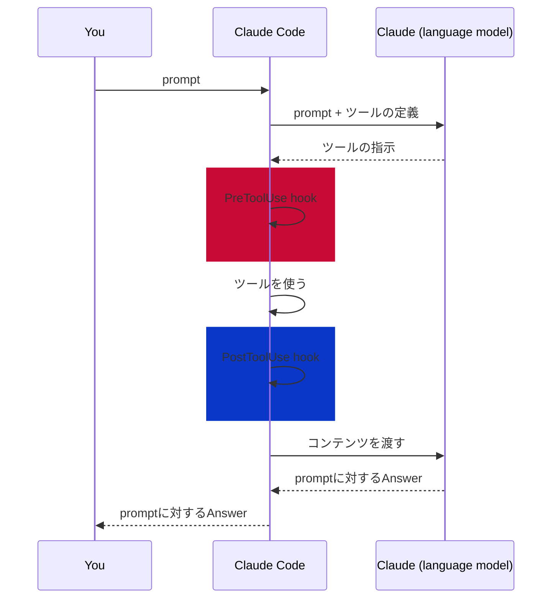

# [Introducing hooks](https://anthropic.skilljar.com/claude-code-in-action/312000)

## Summary

- hooks は ClaudeがToolsを実行する前後で必ず実行するコマンド。
- prompt送信からanswer受信するまでのフローは以下の通り。HooksはClaude Codeによるツールの使用前後で挿入される以下の二つがある
  - **PreToolUse** : Claudeができることをコントロールする
  - **PostToolUse**： Claudeが処理した内容について、追加で処理させる



- 設定
  - 以下のファイルを手動で書くか、`/hooks`というコマンドをClaude Code上で打って設定する。
    - **Global**: `~/.claude/settings.json`
    - **Project**: `.claude/settings.json`
    - **Project(個人設定)**: `.claude/settings.local.json`
  - 記載するJSONは以下のようなフォーマットになり、PreToolUse,PostToolUseそれぞれに対し、macherというhooksを発火させる際のフィルタリングの条件と実際に起動させるhooksをリストで記載する。
```json
{
    "hooks": {
        "PreToolUse": [
            {
                "matcher" : "Read",
                "hooks" : [
                    {
                        "type": "command",
                        "command" : "~~~"
                    }
                ]
            },
            ...
        ],
        "PostToolUse": [
            {
                "matcher" : "Write|Edit|MultiEdit",
                "hooks" : [
                    {
                        "type": "command",
                        "command" : "~~~"
                    }
                ]
            },
            ...
        ]
    }
}
```


### Note/Tips


- hooksに記載する`matcher`は記載しない,あるいは`*(ワイルドカード)`やそもそもmatcherを省略することで、どんな条件下でも呼び出すことができる<sup>[2](#ref1)</sup>
- 一方、matcherに特定の値を指定すると特定の条件下でのみ発火するようにフィルタリングすることができる。<sup>[2](#ref1)</sup>
- or を示したいとき： `|` , `,`<sup>[2](#ref1)</sup>
- matcher は完全一致<sup>[2](#ref1)</sup>
- 正規表現も扱える。<sup>[2](#ref1)</sup>
  - `^Notebook` はNotebookで始まる任意のツールを指定できる<sup>[2](#ref1)</sup>
  - `MCP__memory__.*` はmemoryサーバーのすべてのツールにマッチする。<sup>[2](#ref1)</sup>

## Supplement

- Hooksのより詳細な情報は[1](#ref1)を参照。
- PreToolUse / PostToolUse の決定的な違い（ブロック可否）
  - **PreToolUse**: コマンドはツール呼び出しの詳細を受け取り、①そのまま実行を許可 ②呼び出しをブロックしClaudeにエラーメッセージを返す、のどちらかを選べる。
  - **PostToolUse**: ツールは既に実行済みのため**ブロックできない**。できるのは後続処理（編集直後のフォーマット等）かClaudeへのフィードバックのみ。
- Hooksが有効なケース
  - Claudeが編集した後に、自動でフォーマッティングさせたり、コーディング規約に適合しているかチェックする
  - ファイル変更時に自動でテストさせる
  - ガードレールとして、Claudeが編集する前に、特定のファイルへの編集をブロックする
  - Claudeによるファイルへのアクセスや編集をログに残す
  - Claudeが実施した結果に対してなにかしらのFeedbackをする

## Reference

<a src="ref1"></a>
１． [hooks でアクションを自動化する](https://code.claude.com/docs/ja/hooks-guide)

<a src="ref2"></a>
２． [matcher pattern](https://code.claude.com/docs/ja/hooks#matcher-patterns)